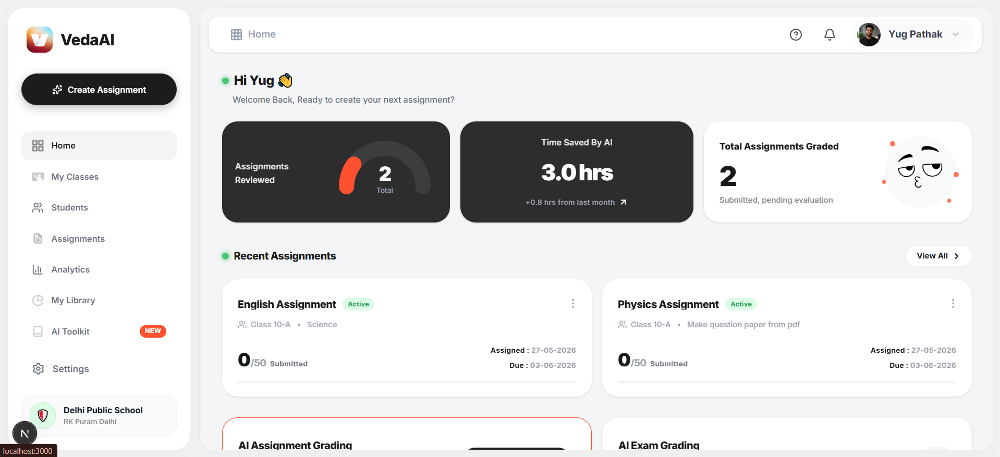
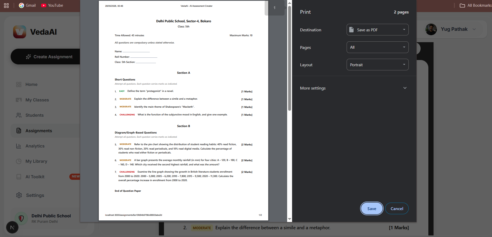
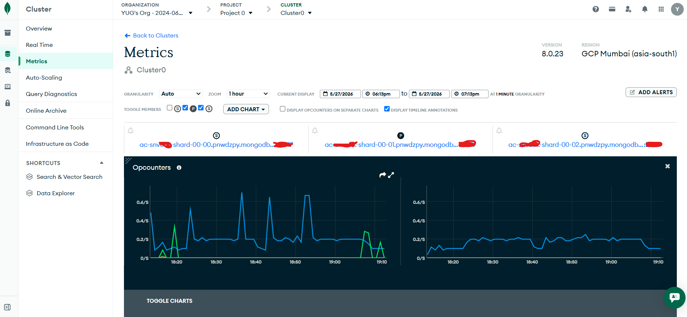
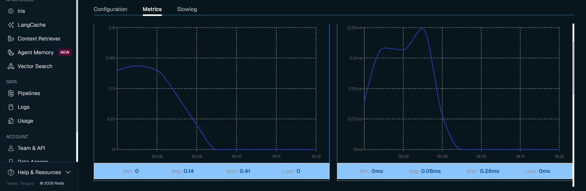

<div align="center">
  

  # VedaAI 🚀
  **The Next-Generation AI Educational Workspace**

  <p align="center">
    
    
    
    
    
  </p>
</div>

<br />

Welcome to **VedaAI**! An enterprise-grade, highly responsive web application designed to revolutionize how educators create, manage, and grade assignments. By leveraging cutting-edge Generative AI (Gemini / GPT) and robust background processing, VedaAI automates the heavy lifting of curriculum management, allowing teachers to focus on what matters most: teaching.

---

## 🌟 Key Functionalities

### 1. 🤖 AI-Powered Exam Generation
Automatically generate highly customized exam papers, quizzes, and short-answer questions directly from reference materials (PDFs or Text). The AI engine extracts context and formulates grade-appropriate questions seamlessly.

### 2. 👥 Complete Student & Class Management
A centralized hub to manage student rosters, class distributions, and roll numbers. The responsive UI allows for quick edits, additions, and archival of records without breaking workflow.

### 3. 📄 High-Quality PDF Exports
Assignments and generated question papers can be instantly previewed in a beautiful, print-ready document format and exported directly to PDF for offline use or physical distribution.

### 4. 📊 Real-Time Analytics Dashboard
Track productivity with built-in analytics. Monitor how much time the AI has saved you, track total assignments reviewed, and visualize active vs. completed tasks in real-time.

---

## 🏗️ Architecture Overview

VedaAI is built on a scalable, decoupled architecture to ensure maximum performance, reliability, and real-time responsiveness.

<div align="center">
  <!-- Place your MongoDB/Redis Metrics Screenshots here -->
  
  <p><i>The highly polished, fully responsive VedaAI Dashboard.</i></p>
</div>

### Tech Stack Breakdown
* **Frontend:** Next.js (App Router), React, TailwindCSS, Framer Motion (for micro-interactions).
* **Backend:** Node.js, Express, TypeScript.
* **Database:** MongoDB Atlas (Primary Data Store).
* **Queue & Caching:** Redis Cloud & BullMQ (Background Jobs).
* **Real-time:** WebSockets.

### 🔄 The Background Processing Flow
To ensure the user interface never freezes during heavy AI generation tasks, we utilize a robust queueing system:
1. **API Request:** User uploads a PDF and requests a new exam paper.
2. **Job Queued:** The Express backend immediately queues the task in **Redis** via **BullMQ** and returns a `202 Accepted` response.
3. **Worker Processing:** An isolated worker picks up the job, parses the PDF, and communicates with the AI APIs (Gemini/OpenRouter).
4. **Data Persistence:** The generated result is safely stored in **MongoDB**.
5. **Real-Time Notification:** A **WebSocket** event is broadcasted to the frontend, instantly updating the UI to show the completed assignment.

---

## 💡 Engineering Approach & Polish

### ⚡ Better Caching & State Management
By offloading job states and caching temporary workflow data to **Redis**, the primary MongoDB database is protected from high-frequency read/write operations during AI generation polling. This results in incredibly low latency and a highly scalable backend.

### 🎨 Uncompromising UI/UX Polish
VedaAI doesn't just work well; it feels premium. 
* **Glassmorphism & Micro-animations:** Every button click, hover, and page transition is smoothed out using `framer-motion`.
* **Zero Layout Shift:** Modals and dropdowns are engineered to prevent UI clipping (utilizing careful layering and responsive breakpoints).
* **Fully Responsive:** Whether viewed on a 4K monitor or a mobile device, the application adapts gracefully.

---

## 🚀 Local Setup Instructions

Ready to run VedaAI locally? Follow these steps:

### Prerequisites
* **Node.js** (v18 or higher)
* **MongoDB** (Local instance or MongoDB Atlas)
* **Redis** (Local instance or Redis Cloud)

### 1. Clone the Repository
```bash
git clone https://github.com/Yug210705/VedaAI.git
cd VedaAI
```

### 2. Setup the Backend
Open a terminal and navigate to the backend directory:
```bash
cd backend
npm install
```

Create a `.env` file in the `backend` directory and add the following variables:
```env
PORT=5001
MONGO_URI=mongodb+srv://<username>:<password>@cluster.mongodb.net/vedaai
REDIS_URL=redis://default:<password>@<redis-endpoint>:<port>
GEMINI_API_KEY=your_gemini_api_key
GPT_OSS_API_KEY=your_openrouter_api_key
```

Start the backend server in development mode:
```bash
npm run dev
```

### 3. Setup the Frontend
Open a new terminal and navigate to the frontend directory:
```bash
cd frontend
npm install
```

Create a `.env` file (or `.env.local`) in the `frontend` directory:
```env
NEXT_PUBLIC_API_URL=http://localhost:5001/api
```

Start the Next.js development server:
```bash
npm run dev
```

### 4. Open the App
Visit [http://localhost:3000](http://localhost:3000) in your browser to see VedaAI in action!

---

## 📸 Screenshots

*(For the best documentation experience, place the screenshots provided below in a `docs` folder at the root of the repository and update the paths accordingly!)*

| Dashboard Overview | Assignment PDF Generation |
| :---: | :---: |
|  |  |

| MongoDB Atlas Analytics | Redis Cloud Queue Metrics |
| :---: | :---: |
|  |  |

---

<div align="center">
  Built with ❤️ by Yug Pathak
</div>
